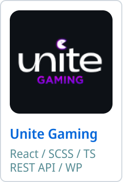
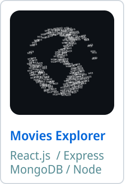
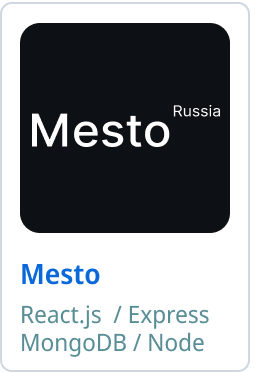
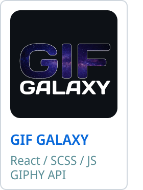

  <!--  -->
  
  <!--  -->

---

## Introduction
Hi, my name is Stepanov Andrei and I am a beginner front-end developer. I have a passion for creating clean, functional websites and applications that are accessible to everyone. This GitHub profile is where I showcase my work and progress in the development field.

---

## Skills

  &nbsp;
  &nbsp;
   &nbsp;
  &nbsp;
  &nbsp;
  &nbsp;
  &nbsp;
  &nbsp;
  

- React.js / Next.js
- Redux / Redux Toolkit
- Webpack / Gulp / Vite
- CSS3 / SCSS /SASS
- JavaScript / TypeScript

---

## Projects

  
  
  
  
  

<!-- ### How to learn
- Created a website as a first step in learning HTML and CSS.
- Included basic interactivity through hover effects and clickable links.
- Project resulted in a beginner level website using HTML, CSS, and BEM methodology.
### Russian Travel
- This project is an adaptive website built with HTML, CSS and JS.
- It has a responsive design that is optimized to work seamlessly on different devices and features modal windows that are implemented using JavaScript
### Mesto
- This project is built using HTML, CSS, and JavaScript
- Utilizes OOP concepts for its implementation
- Additionally, Mesto was built using Webpack to optimize and bundle the code for production, and Babel was used to ensure cross-browser compatibility and transpile modern JavaScript features to older syntax. This ensures that the application is able to function properly on a variety of browsers and devices.
- Enables users to manage their photos
- Allows users to add, edit, and remove their photos
- Permits users to like other users' photos
### Mesto React.js
- This is my first React.js project that I completed as part of the Yandex.Practicum curriculum. The application includes the following features:
- React Router for routing and navigation
- Custom hooks and a Higher-Order Component for its implementation
- OOP principles and a REST API for its backend functionality
- Authentication features
- The key functionalities of this application are:
- Adding, removing, and editing user photos
- Updating profile information such as avatar image, name, and description
- Liking other users' photos
- Other notable aspects of the project include: 
- Webpack was utilized for bundling and optimizing code for production
- Cross-browser compatibility was ensured through Babel -->

---

### :fire: My Stats:

<!--  -->

---

## Contact Me

  
  
  

Feel free to contact me with any inquiries or collaboration opportunities.
---

## Conclusion
Thank you for taking the time to check out my GitHub profile. I am excited to grow my skills and experience in front-end development, and I look forward to sharing my progress with the community.

