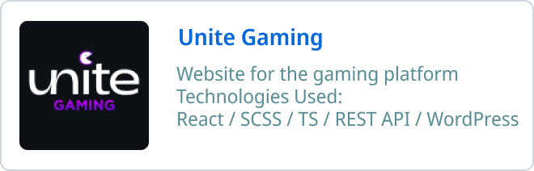
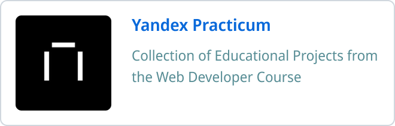
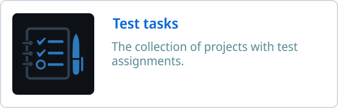

## Introduction

Hey there! I'm Andrew, a full-stack web developer passionate about crafting sleek, functional websites and applications. With a solid background in both front-end and back-end development, I specialize in creating comprehensive solutions.

🚀 Here's a snapshot of my tech stack:

- React.js / Next.js
- Redux / Redux Toolkit
- Webpack / Gulp / Vite
- CSS3 / SCSS / SASS
- JavaScript / TypeScript
- Node.js / Express.js
- MongoDB / MySQL

Let's collaborate and create exceptional web experiences together!

---

<!--
## Projects

  &nbsp;
  &nbsp;
  &nbsp;
  

 -->

---

### :fire: My Stats:

<!--  -->

---

## Contact Me

  
  
  

Feel free to contact me with any inquiries or collaboration opportunities.

---

## Conclusion

Thank you for taking the time to check out my GitHub profile. I am excited to grow my skills and experience in front-end development, and I look forward to sharing my progress with the community.

